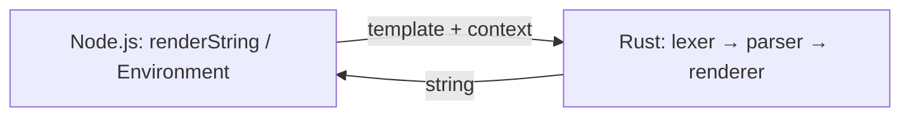

# Runjucks

**Runjucks** is a [Nunjucks](https://mozilla.github.io/nunjucks/)-compatible template engine whose **rendering core is implemented in Rust**, exposed to Node.js via [NAPI-RS](https://napi.rs/). The goal is the same JavaScript/TypeScript API surface as Nunjucks, with faster rendering for CPU-heavy templates.

This repository also serves as a **learning project** for Rust: lexer, parser, tree-walk interpreter, and Node bindings are implemented incrementally.

## Status

**Implemented (Rust core + Node bindings):**

- **Output** — `{{ … }}` with Nunjucks-oriented expressions: literals, variables, `.` / `[…]` / `(…)`, unary/binary operators, chained comparisons, `in`, inline `cond if a else b`, list and object literals, and `is` tests (including `equalto` / `sameas` call forms).
- **Filters** — Pipelines `| name` / `| name(args)` with a growing built-in set: `upper`, `lower`, `length`, `join`, `replace`, `round`, `escape` / `e`, `default`, `abs`, `capitalize`, plus HTML auto-escaping when `autoescape` is on.
- **Tags** — `` / `` / `` / ``, `………` (JS-style fall-through on empty `case` bodies), `` with **tuple unpack** (`a, b` / `a, b, c`) and **`k, v` over objects** (keys sorted for stable output), **`loop.*`** (`index`, `index0`, `first`, `last`, `length`, `revindex`, `revindex0`), optional ``, `` (**multi-target** `a, b = expr`, **block** `…`, Nunjucks-like **frame scoping** with `for`), `` with optional **`ignore missing`**, `` with `…`, and same-file `…` with `{{ macroName(args) }}` calls.
- **Composition** — [`TemplateLoader`](native/crates/runjucks-core/src/loader.rs) on [`Environment`](native/crates/runjucks-core/src/environment.rs): `render_template(name, ctx)` in Rust; in Node, `setTemplateMap({ ... })` or **`setLoaderRoot(path)`** for disk-backed templates, then `renderTemplate(name, ctx)`. Optional **`require('@zneep/runjucks/express').expressEngine`** wires Express `app.engine` (see docs).
- **Other** — Plain text, `{# comments #}`, JSON object context, and variable lookup through a **frame stack** (inner `for` bodies shadow outer names; `` resolves assignments up the stack like Nunjucks).

**Still missing or stubbed (typical next steps vs Nunjucks):**

- **Loaders** — **`setTemplateMap`**, **`setLoaderRoot`**, and **`setLoaderCallback`** (sync JS) are supported; **URL / async** loaders and **`http(s):`** loading are not built-in (see [`NUNJUCKS_PARITY.md`](NUNJUCKS_PARITY.md)).
- **Async / precompile / browser** — **P3**; intentionally deferred (see [`P3_ROADMAP.md`](P3_ROADMAP.md)).
- **Parity** — Conformance JSON + [`__test__/parity.test.mjs`](__test__/parity.test.mjs) vs `nunjucks` 3.2.4; run **`npm run check:conformance-allowlist`** when adding fixture `id`s. Full backlog: [`NUNJUCKS_PARITY.md`](NUNJUCKS_PARITY.md).

Development continues against [Nunjucks](https://github.com/mozilla/nunjucks) behavior; if you keep a checkout next to this repo, the vendored tree is still useful as [`../nunjucks`](../nunjucks).

## Architecture

| Original Nunjucks | Runjucks |
|-------------------|----------|
| lex → parse → transform → **compile to JS** → `new Function` → run | lex → parse → **tree-walk render in Rust** |

Template context is passed from JavaScript as a plain object and converted to `serde_json::Value` on the Rust side.



### Repository layout

| Area | Contents |
|------|----------|
| **Node package** (this directory) | `package.json`, `index.js`, `index.d.ts`, `__test__/`, generated `*.node` |
| **[`native/`](native/)** | Cargo **workspace** ([`native/Cargo.toml`](native/Cargo.toml)): [`runjucks_core`](native/crates/runjucks-core/) (engine), [`runjucks-napi`](native/crates/runjucks-napi/) (Node addon), [`native/fixtures/`](native/fixtures/) |

### Rust workspace (`native/crates/`)

| Crate / module | Role |
|----------------|------|
| [`runjucks_core`](native/crates/runjucks-core/) | Pure Rust engine (`lexer`, `parser`, `ast`, `renderer`, `environment`, …); publishable to crates.io |
| [`runjucks-napi`](native/crates/runjucks-napi/) | `#[napi]` bindings (`renderString`, `Environment`) → `.node` binary |
| [`runjucks_core::lexer`](native/crates/runjucks-core/src/lexer.rs) | Tokenizer (to match `nunjucks/src/lexer.js`) |
| [`runjucks_core::parser`](native/crates/runjucks-core/src/parser/mod.rs) | Template structure + [`parser::expr`](native/crates/runjucks-core/src/parser/expr.rs) (`nom`, Nunjucks-style precedence) |
| [`runjucks_core::ast`](native/crates/runjucks-core/src/ast.rs) | AST nodes and expressions |
| [`runjucks_core::renderer`](native/crates/runjucks-core/src/renderer.rs) | Tree-walk interpreter |
| [`runjucks_core::environment`](native/crates/runjucks-core/src/environment.rs) | `Environment::render_string`: lex → parse → render; `autoescape` / `dev` |
| [`runjucks_core::tag_lex`](native/crates/runjucks-core/src/tag_lex.rs) | Tokenize `` tag bodies (keywords / identifiers) |
| [`runjucks_core::filters`](native/crates/runjucks-core/src/filters.rs) | Built-in filters (growing over time) |
| [`runjucks_core::value`](native/crates/runjucks-core/src/value.rs) | JSON value → string for output |
| [`runjucks_core::errors`](native/crates/runjucks-core/src/errors.rs) | Error types |

## Prerequisites

- **Rust** (stable), **Node.js** ≥ 18, **npm** (canonical toolchain for this package)
- **Documentation site** ([`docs/`](docs/)): **Node.js ≥ 22.12** (required by current Astro; see [`docs/package.json`](docs/package.json) `engines`)

### Package manager (Node-first, optional Bun)

**Default (what CI uses):** install with **npm** and run **`npm run …`** scripts from this directory.

```bash
npm install
npm run build
npm test
npm run docs:dev
```

**Optional — [Bun](https://bun.sh):** you can use the same script names; lockfiles remain npm (`package-lock.json`).

```bash
bun install
bun run build
bun run test
# Docs live in docs/ — from repo root, docs scripts use npm --prefix; with Bun:
cd docs && bun run dev
cd docs && bun run build
```

**Caveats:**

- The **native NAPI build** is validated on **Node** in GitHub Actions. If `bun run build` or tests misbehave, switch to Node/npm.
- **`npm test`** uses **`node --test`**. That is not the same as **`bun test`**; keep using `npm test` (or `bun run test`, which runs the npm script and invokes `node --test`) for parity with CI.

See [`CONTRIBUTING.md`](CONTRIBUTING.md) for a short contributor-focused summary.

## Documentation site

The Starlight + TypeDoc site lives in [`docs/`](docs/). From this directory:

```bash
npm run docs:dev      # local dev server
npm run docs:build    # TypeDoc + rustdoc + Starlight → docs/dist/
```

Deploy: enable **GitHub Pages** (GitHub Actions) and use [`.github/workflows/docs.yml`](.github/workflows/docs.yml). Set `ASTRO_BASE_PATH` if your Pages URL uses a project path (see [`docs/README.md`](docs/README.md)). The site includes **Template language**, **JavaScript API**, **Performance**, and **Limitations** guides under [`docs/src/content/docs/guides/`](docs/src/content/docs/guides/).

## Performance

- **User guide:** [Performance](docs/src/content/docs/guides/performance.md) (caching, release builds, measuring).
- **Maintainer backlog:** [`RUNJUCKS_PERF.md`](RUNJUCKS_PERF.md); **`npm run perf`** / **`npm run bench:rust`** compare workloads vs Nunjucks and Rust microbenches.

## Development

```bash
cd runjucks
npm install
npm run build        # release build; produces runjucks.<platform>.node + index.js + index.d.ts
npm test             # Node tests: __test__/*.test.mjs + JSON conformance (__test__/conformance/run.mjs); requires `npm run build` first
npm run test:rust    # Rust integration tests (`native/crates/runjucks-core/tests/`; `cargo test --manifest-path native/Cargo.toml`)
```

Debug builds:

```bash
npm run build:debug
```

### Testing

Integration tests live under [`native/crates/runjucks-core/tests/`](native/crates/runjucks-core/tests/). The **`runjucks_core`** crate documents the full engine API (see `cargo doc -p runjucks_core` or the docs site’s **Rust crate (rustdoc)** link).

- **`npm run test:rust`** or **`cargo test --manifest-path native/Cargo.toml`** — all Rust integration tests.
- **`npm test`** — Node tests: hand-written cases, **`__test__/parity.test.mjs`** (runjucks vs `nunjucks` npm on the perf allowlist), and JSON goldens for the NAPI layer (run `npm run build` first).
- **`npm run test:rust:green`** — subset of Rust tests (see [`package.json`](package.json)).
- **`npm run test:conformance:rust`** / **`npm run test:conformance:node`** — same as the JSON suite in `npm test` (split out for focused runs); skipped cases use `"skip": true` in the fixture until parity lands (see [`NUNJUCKS_PARITY.md`](NUNJUCKS_PARITY.md)).
- **`npm run check:conformance-allowlist`** — verifies every non-skipped fixture `id` in [`native/fixtures/conformance/`](native/fixtures/conformance/) appears in [`perf/conformance-allowlist.json`](perf/conformance-allowlist.json) (runs in CI).
- **`npm run perf`** / **`npm run perf:json`** — local-only speed comparison vs `nunjucks` (see [`perf/README.md`](perf/README.md); `perf:json` writes `perf/last-run.json`; run `npm run build` first).
- **`npm run test:pending`** — optional Node checks in [`__test__/interpolation-pending.mjs`](__test__/interpolation-pending.mjs).
- Optional Mocha-style harness notes: [`test-shim/README.md`](test-shim/README.md).

## JavaScript API

Generated TypeScript definitions are in [`index.d.ts`](index.d.ts). The entry points mirror Nunjucks-style naming:

- **`renderString(template, context)`** — render with default options (autoescape on).
- **`new Environment()`** — `renderString`, `setAutoescape`, `setDev`, **`setTemplateMap`**, **`renderTemplate`**, **`addFilter`** (JS callbacks), **`addGlobal`**, etc.

Example:

```js
import { renderString, Environment } from '@zneep/runjucks'

console.log(renderString('{{ greeting | upper }}', { greeting: 'hello' }))

const env = new Environment()
env.setAutoescape(true)
console.log(
  env.renderString('{{ label }}no', {
    ok: true,
    label: '<em>x</em>',
  }),
)

env.setTemplateMap({
  'base.html': '<html></html>',
  'page.html': 'Hi',
})
console.log(env.renderTemplate('page.html', {}))
```

## Reference code

Compare behavior with [mozilla/nunjucks](https://github.com/mozilla/nunjucks) (`nunjucks/src/`). When porting, keep the same lexer/parser/render concepts but **replace compile-to-JS + `eval`** with this crate’s AST and tree-walk renderer.

## Publishing

npm and crates.io releases run on **pushes to `main`** when the respective version fields change (see [`RELEASING.md`](RELEASING.md)). You can also **Run workflow** manually in the Actions tab.

## License

MIT — see [`LICENSE`](LICENSE).
