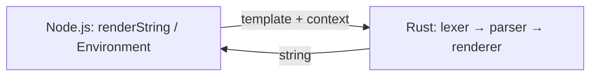

# Runjucks

**Runjucks** is a [Nunjucks](https://mozilla.github.io/nunjucks/)-compatible template engine whose **rendering core is implemented in Rust**, exposed to Node.js via [NAPI-RS](https://napi.rs/). The goal is the same JavaScript/TypeScript API surface as Nunjucks, with faster rendering for CPU-heavy templates.

This repository also serves as a **learning project** for Rust: lexer, parser, tree-walk interpreter, and Node bindings are implemented incrementally.

## Status

Work in progress: `{{ }}` variables, `{# #}` comments, and plain text; ``, filters, inheritance, and loaders are not implemented yet. Reference: [`../nunjucks`](../nunjucks).

## Architecture

| Original Nunjucks | Runjucks |
|-------------------|----------|
| lex → parse → transform → **compile to JS** → `new Function` → run | lex → parse → **tree-walk render in Rust** |

Template context is passed from JavaScript as a plain object and converted to `serde_json::Value` on the Rust side.



### Repository layout

| Area | Contents |
|------|----------|
| **Node package** (this directory) | `package.json`, `index.js`, `index.d.ts`, `__test__/`, generated `*.node` |
| **[`native/`](native/)** | Rust crate: [`native/Cargo.toml`](native/Cargo.toml), [`native/src/`](native/src/) (NAPI + engine), [`native/src/tests/`](native/src/tests/) (integration tests) |

### Rust crate (`native/src/`)

| Module | Role |
|--------|------|
| [`native/src/lexer.rs`](native/src/lexer.rs) | Tokenizer (to match `nunjucks/src/lexer.js`) |
| [`native/src/parser.rs`](native/src/parser.rs) | Recursive-descent parser |
| [`native/src/ast.rs`](native/src/ast.rs) | AST nodes and expressions |
| [`native/src/renderer.rs`](native/src/renderer.rs) | Tree-walk interpreter |
| [`native/src/environment.rs`](native/src/environment.rs) | Options (autoescape, dev, …) |
| [`native/src/filters.rs`](native/src/filters.rs) | Built-in filters (growing over time) |
| [`native/src/value.rs`](native/src/value.rs) | JSON value → string for output |
| [`native/src/errors.rs`](native/src/errors.rs) | Error types |
| [`native/src/lib.rs`](native/src/lib.rs) | NAPI exports (`renderString`, `Environment`) |

## Prerequisites

- **Rust** (stable), **Node.js** ≥ 18, **npm**

## Development

```bash
cd runjucks
npm install
npm run build        # release build; produces runjucks.<platform>.node + index.js + index.d.ts
npm test             # Node tests (__test__/*.test.mjs; requires `npm run build` first)
npm run test:rust    # Rust integration tests (`native/src/tests/`; same as `cargo test --manifest-path native/Cargo.toml`)
```

Debug builds:

```bash
npm run build:debug
```

### Testing

Integration tests live under [`native/src/tests/`](native/src/tests/). Internal modules used only by tests are `#[doc(hidden)]` in [`native/src/lib.rs`](native/src/lib.rs).

- **`npm run test:rust`** or **`cargo test --manifest-path native/Cargo.toml`** — all Rust integration tests.
- **`npm test`** — Node tests (run `npm run build` first).
- **`npm run test:rust:green`** — subset of Rust tests (see [`package.json`](package.json)).
- **`npm run test:pending`** — optional Node checks in [`__test__/interpolation-pending.mjs`](__test__/interpolation-pending.mjs).

## JavaScript API

Generated TypeScript definitions are in [`index.d.ts`](index.d.ts). The entry points mirror Nunjucks-style naming:

- **`renderString(template, context)`** — render with default options.
- **`new Environment()`** — configurable environment with `renderString`, `setAutoescape`, `setDev`, and `addFilter` (stub until custom filters are implemented).

Example:

```js
import { renderString, Environment } from 'runjucks'

console.log(renderString('Hello', {}))

const env = new Environment()
env.setAutoescape(true)
console.log(env.renderString('Plain text only for now', { name: 'Ada' }))
```

## Reference code

The upstream Nunjucks source lives in [`../nunjucks`](../nunjucks) (e.g. `nunjucks/nunjucks/src/`). When porting, follow the same pipeline concepts but **replace codegen + `eval`** with direct AST interpretation in Rust.

## License

MIT (match Nunjucks / your choice when publishing).
