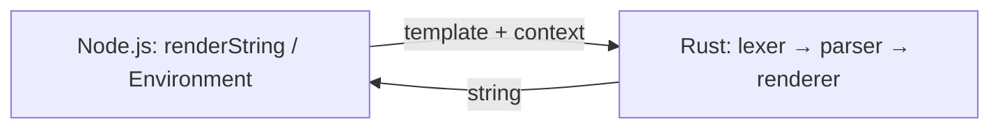

# Runjucks

**Runjucks** is a [Nunjucks](https://mozilla.github.io/nunjucks/)-compatible template engine whose **rendering core is implemented in Rust**, exposed to Node.js via [NAPI-RS](https://napi.rs/). The goal is the same JavaScript/TypeScript API surface as Nunjucks, with faster rendering for CPU-heavy templates.

This repository also serves as a **learning project** for Rust: lexer, parser, tree-walk interpreter, and Node bindings are implemented incrementally.

## Status

**Early scaffold.** The pipeline is wired end-to-end (lex → parse → render → NAPI), but the lexer currently emits the whole template as a single text token. `{{ }}`, ``, filters, inheritance, and loaders are **not** implemented yet—see the sibling [`nunjucks`](../nunjucks) tree for the reference implementation.

## Architecture

| Original Nunjucks | Runjucks |
|-------------------|----------|
| lex → parse → transform → **compile to JS** → `new Function` → run | lex → parse → **tree-walk render in Rust** |

Template context is passed from JavaScript as a plain object and converted to `serde_json::Value` on the Rust side.



### Crate layout

| Module | Role |
|--------|------|
| [`src/lexer.rs`](src/lexer.rs) | Tokenizer (to match `nunjucks/src/lexer.js`) |
| [`src/parser.rs`](src/parser.rs) | Recursive-descent parser |
| [`src/ast.rs`](src/ast.rs) | AST nodes and expressions |
| [`src/renderer.rs`](src/renderer.rs) | Tree-walk interpreter |
| [`src/environment.rs`](src/environment.rs) | Options (autoescape, dev, …) |
| [`src/filters.rs`](src/filters.rs) | Built-in filters (growing over time) |
| [`src/value.rs`](src/value.rs) | JSON value → string for output |
| [`src/errors.rs`](src/errors.rs) | Error types |
| [`src/lib.rs`](src/lib.rs) | NAPI exports (`renderString`, `Environment`) |

## Prerequisites

- **Rust** (stable), **Node.js** ≥ 18, **npm**

## Development

```bash
cd runjucks
npm install
npm run build        # release build; produces runjucks.<platform>.node + index.js + index.d.ts
npm test             # Node tests (__test__/*.test.mjs; requires `npm run build` first)
cargo test           # Rust unit tests + integration tests (`tests/`)
```

Debug builds:

```bash
npm run build:debug
```

### Testing

Rust follows the usual layout: **integration tests** live under [`tests/`](tests/) (one file per area: `lexer.rs`, `parser.rs`, `renderer.rs`, …) and call the crate API via `use runjucks::…`. Implementation files under `src/` stay free of `#[cfg(test)]` blocks.

Internal modules (`lexer`, `parser`, `renderer`, …) are `pub` so those tests can run, but marked **`#[doc(hidden)]`** in [`src/lib.rs`](src/lib.rs) so they don’t clutter the primary rustdoc surface (the NAPI/`Environment` story).

- **`cargo test`** — all `tests/*.rs` (no Node required).
- **`npm test`** — loads the compiled `.node` addon via [`__test__/`](__test__/) (run `npm run build` first).

## JavaScript API

Generated TypeScript definitions are in [`index.d.ts`](index.d.ts). The entry points mirror Nunjucks-style naming:

- **`renderString(template, context)`** — render with default options.
- **`new Environment()`** — configurable environment with `renderString`, `setAutoescape`, `setDev`, and `addFilter` (stub until custom filters are implemented).

Example:

```js
import { renderString, Environment } from 'runjucks'

console.log(renderString('Hello', {}))

const env = new Environment()
env.setAutoescape(true)
console.log(env.renderString('Plain text only for now', { name: 'Ada' }))
```

## Reference code

The upstream Nunjucks source lives in [`../nunjucks`](../nunjucks) (e.g. `nunjucks/nunjucks/src/`). When porting, follow the same pipeline concepts but **replace codegen + `eval`** with direct AST interpretation in Rust.

## License

MIT (match Nunjucks / your choice when publishing).
