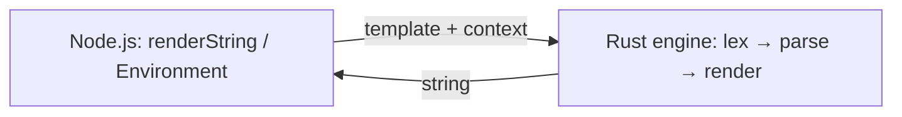

## Pipeline

| Nunjucks | Runjucks |
|----------|----------|
| lex → parse → transform → **compile to JS** → `new Function` → run | lex → parse → **tree-walk render** in Rust |

Template context from JavaScript is passed as a **plain object** and converted to a JSON-compatible representation for the engine.

The npm package is a **thin binding layer** around that engine. If you work on the Rust code, browse the **[Rust API (rustdoc)](../contributing/rust/)** on this site or open the repo layout described there.

## Reference implementation

When comparing behavior, the [Nunjucks source](https://github.com/mozilla/nunjucks) remains the reference for intent. Runjucks does **not** compile templates to JavaScript or `eval` them; it evaluates an AST with the same broad language goals.
