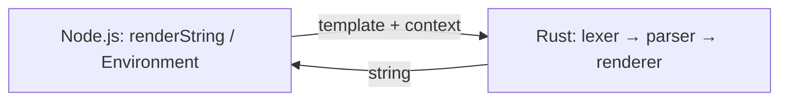

## Pipeline

| Nunjucks | Runjucks |
|----------|----------|
| lex → parse → transform → **compile to JS** → `new Function` → run | lex → parse → **tree-walk render in Rust** |

Template context from JavaScript is passed as a plain object and converted to `serde_json::Value` on the Rust side.

## Rust workspace (`native/crates/`)

| Crate / module | Role |
|----------------|------|
| **`runjucks_core`** | Pure engine: `lexer`, `parser`, `ast`, `renderer`, `environment`, `filters`, `value`, `errors` |
| **`runjucks-napi`** | NAPI exports (`renderString`, `Environment`) built as the `.node` addon |

## Reference implementation

When porting behavior, use the [Nunjucks source](https://github.com/mozilla/nunjucks) as a reference — same pipeline ideas, but **no** compile-to-JS + `eval`; interpretation stays in Rust.
